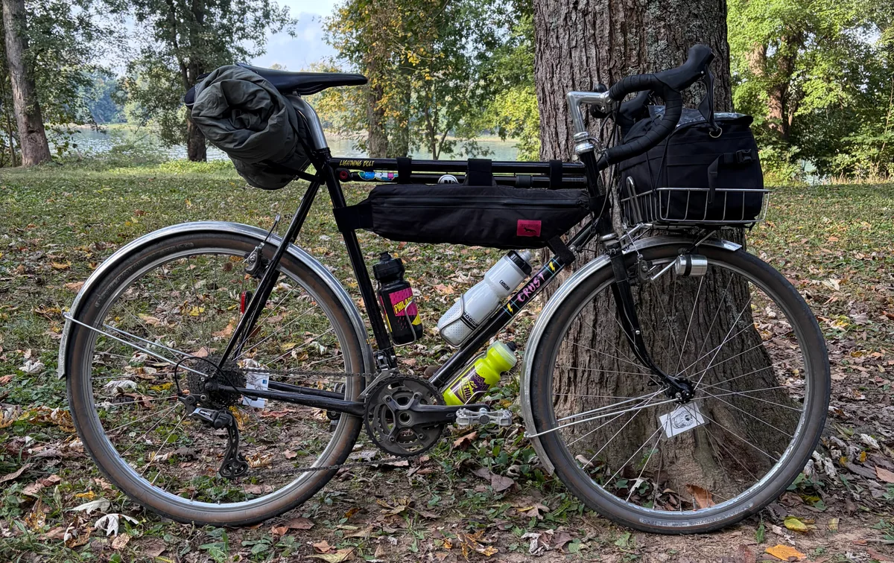

# Autumn Bikepacking

I went on my first bikepacking trip with a friend after talking about doing one for years. It was a sub-24-hour overnight ([S24O](https://www.adventurecycling.org/blog/s24os/))—barely—up the C&O canal towpath.

The adventure was successful and it was everything that I hoped for.

This was the perfect ode to Autumn. The foliage in the DMV area is really something special. It's amazing how accessible nature is in the Washington metro area. In fact, I enjoyed the route so much that I went back the next weekend for a hike.

I chose not to purchase any additional racks or bags, which resulted in a lean packing list. I brought nothing that I regret, but there was plenty that I wish I had. All of it comes down to creature comforts.

I would definitely get some additional cargo space for future trips. These are the items I wished I had:

- camping chair - it's nice not to have to sit on the ground
- under quilt or sleeping pad - it got a little cold in the hammock at night - even at 50+ degrees
- my [Snow Peak Collapsible Coffee Drip](https://www.snowpeak.com/products/collapsible_pour_over-cs-113) pour over - instant coffee did the trick
- some way to filter non-potable water - we ended up using a lot for cooking (and someone only brought one bottle, but I'm not pointing fingers)
- more snacks - duh

The Crust Lightning Bolt (pictured above), wrapped in 42mm tires, was nimble, comfortable, and speedy. I didn't really mind that the bike weighed about 50lbs fully-laden. Dynamo lighting seems like a must-have on trips like this. It's just too convenient not to have.

I would also like to point out that, as a rando bike, the Lightning Bolt is really only capable designed for shorter 1-2 day trips like this

I'm worried that it's getting a little too cold to go again this fall, but I'm still holding out for another trip.
